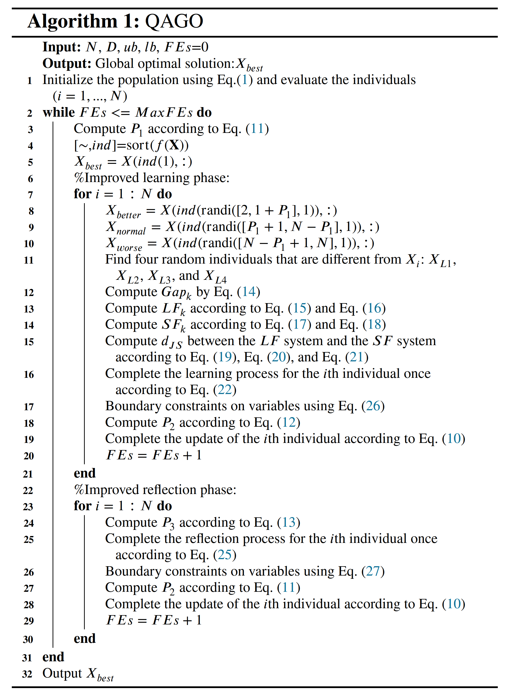

# QAGO


**Title**: Quadruple parameter adaptation growth optimizer with integrated distribution, confrontation, and balance features for optimization

```
 Authors：Hao Gao, Qingke Zhang*, Xianglong Bu, Huaxiang Zhang
```
*  School of Information Science and Engineering, Shandong Normal University, Jinan 250358, China

Corresponding Author: **Qingke Zhang** , Email: tsingke@sdnu.edu.cn , Tel :  +86-13953128163


## 1. Abstract
Growth optimizer is a novel metaheuristic algorithm that has powerful numerical optimization
capabilities. However, its parameters and search operators become crucial factors that significantly
impact its optimization capability for engineering problems and benchmarks. Therefore, this paper
proposes a quadruple parameter adaptation growth optimizer (QAGO) integrated with distribution,
confrontation, and balance features. In QAGO, the quadruple parameter adaptation mechanism aims
to reduce the algorithmic sensitivity for parameter setting and enhance the algorithmic adaptability.
By employing parameter sampling that adheres to specific probability distributions, the parameter
adaptation mechanism achieves dynamic tuning of the algorithm hyperparameters. Moreover, one-
dimensional mapping and fitness difference methods are designed in the triple parameter self-
adaptation mechanism based on the contradictory relationship to adjust the operator’s parameters.
After that, "spear" and "shield" are balanced based on the Jensen-Shannon divergence in information
theory. Furthermore, the topological structure of the operators is redesigned, and by combining the
parameter adaptation mechanism, operator refinement is achieved. Refined operators can effectively
utilize different evolutionary information to improve the quality of the solution. The experiment
evaluates the performance of QAGO on distinct optimization problems on the CEC 2017 and CEC
2022 test suites. To demonstrate the capability of QAGO in solving real-world applications, it
was applied to tackle two specific problems: multilevel threshold image segmentation and wireless
sensor network node deployment. The results demonstrated that QAGO delivers highly promising
optimization results compared to seventy-one high-performance competing algorithms, including the
five IEEE CEC competition winners.

The source code of the QAGO algorithm is publicly available at [https://github.com/tsingke/QAGO](https://github.com/tsingke/QAGO).

 

## 2. QAGO Pseudocode (MATLAB)



## 3. QAGO Search Behavior Overview


## 4. A List of 50 compared algorithms


## 5. The MATLAB Code of QAGO

```MATLAB
function [gbestX,gbestfitness,gbesthistory]= QAGO(N,D,ub,lb,MaxFEs,Func,FuncId)
%---------------------------------------------------------------------------
% Algorithm Name: QAGO
% gbestx: The global best solution ( gbestx = [x1,x2,...,xD]).
% gbestfitness: Record the fitness value of global best individual.
% gbesthistory: Record the history of changes in the global optimal fitness.
%---------------------------------------------------------------------------

%% (1)Initialization
FEs=0;
x=unifrnd(lb,ub,N,D);
gbestfitness=inf;
fitness=inf(N,1);
for i=1:N
    fitness(i)=Func(x(i,:)',FuncId);
    FEs=FEs+1;
    if gbestfitness>=fitness(i)
        gbestfitness=fitness(i);
        gbestX=x(i,:);
    end
    gbesthistory(FEs)=gbestfitness;
end

%% (2) Loop iteration
while FEs<=MaxFEs
    [~, ind]=sort(fitness);
    % Parameter adaptation based on distribution
    P1=ceil(unifrnd(0.05,0.2)*N);
    P2=normrnd(0.001*ones(1,N),0.001*ones(1,N));
    P3=normrnd(0.3*rand(N,D),0.01);
    
    %% 1. Improved learning phase
    % Sampling individuals
    Best_X=x(ind(1),:);
    worse_index=ind(randi([N-P1+1,N],N,1));
    Worst_X=x(worse_index,:);
    better_index=ind(randi([2,P1],N,1));
    Better_X=x(better_index,:);
    normal_index=ind(randi([P1+1,N-P1],N,1));
    Normal_X=x(normal_index,:);
    [L1,L2,L3,L4]=selectID(N);
    
    for i=1:N
        Gap(1,:)=(Best_X-Better_X(i,:));
        Gap(2,:)=(Better_X(i,:)-Normal_X(i,:));
        Gap(3,:)=(Normal_X(i,:)-Worst_X(i,:));
        Gap(4,:)=(x(L1(i),:)-x(L2(i),:));
        Gap(5,:)=(x(L3(i),:)-x(L4(i),:));
        
        % Parameter self-adaptation based on one-dimensional mapping of vectors
        DGap(1,:)=(Best_X*Better_X(i,:)');
        DGap(2,:)=(Better_X(i,:)*Normal_X(i,:)');
        DGap(3,:)=(Normal_X(i,:)*Worst_X(i,:)');
        DGap(4,:)=(x(L1(i),:)*x(L2(i),:)');
        DGap(5,:)=(x(L3(i),:)*x(L4(i),:)');
        minDistance=min(DGap);
        DGap=DGap+2*abs(minDistance);
        LF=DGap./sum(DGap);
        
        % Parameter self-adaptation based on fitness difference
        FGap(1,:)=(abs(fitness(ind(1))-fitness(better_index(i))));
        FGap(2,:)=(abs(fitness(better_index(i))-fitness(normal_index(i))));
        FGap(3,:)=(abs(normal_index(i)-fitness(worse_index(i))));
        FGap(4,:)=(abs(fitness(L1(i))-fitness(L2(i))));
        FGap(5,:)=(abs(fitness(L3(i))-fitness(L4(i))));
        SF=FGap./sum(FGap);
        
        % Parameter self-adaptation based on Jensen-Shannon divergence
        LS=(LF+SF)/2;
        Djs=0.5*sum(LF.*log(LF./LS))+0.5*sum(SF.*log(SF./LS));
        djs=sqrt(Djs);
        
        % Learning operator refinement
        newx(i,:)=x(i,:)+sum(Gap.*(djs.*LF+(1-djs).*SF),1);
        
        % Boundary constraints
        Flag4ub= newx(i,:)>ub;
        Flag4lb= newx(i,:)<lb;
        newx(i,:)=(newx(i,:).*(~(Flag4ub+Flag4lb)))+(lb+(ub-lb)*rand(1,D)).*Flag4ub+(lb+(ub-lb)*rand(1,D)).*Flag4lb;
        
        % Evaluation
        newfitness(i)=Func(newx(i,:)',FuncId);
        FEs=FEs+1;
        
        % Selection
        if fitness(i)>=newfitness(i)
            fitness(i)=newfitness(i);
            x(i,:)=newx(i,:);
            if gbestfitness>=fitness(i)
                gbestfitness=fitness(i);
                gbestX=x(i,:);
            end
        else
            if rand<P2(i)&&ind(i)~=ind(1)
                fitness(i)=newfitness(i);
                x(i,:)=newx(i,:);
            end
        end
        gbesthistory(FEs)=gbestfitness;
    end % end for
    
    %% 2. Improved reflection phase
    newx=x;
    P2=normrnd(0.001*ones(1,N),0.001*ones(1,N));
    VSCR=rand(N,D);
    VSAF=rand(N,D);
    AF=0.01*(1-FEs/MaxFEs);
    I1=VSCR<P3;
    I2=VSAF<AF;
    R=ind(randi(P1,N,D));
    
    for i=1:N
        % Reflection operator refinement
        for j=1:D
            if I1(i,j)
                if I2(i,j)
                    newx(i,j)=lb+(ub-lb)*rand;
                else
                    S=randperm(N,3);
                    S(S==i)=[];
                    S(S==R(i,j))=[];
                    RM=S(1);
                    newx(i,j)=x(i,j)+rand*((x(R(i,j),j)-x(i,j))+(x(RM,j)-x(i,j)));
                end
            end
        end
        
        % Boundary constraints
        flagub=newx(i,:)>ub;
        newx(i,flagub)=(x(i,flagub)+ub)/2;
        flaglb=newx(i,:)<lb;
        newx(i,flaglb)=(x(i,flaglb)+lb)/2;
        
        % Evaluation
        newfitness(i)=Func(newx(i,:)',FuncId);
        FEs=FEs+1;
        
        % Selection
        if fitness(i)>=newfitness(i)
            fitness(i)=newfitness(i);
            x(i,:)=newx(i,:);
            if gbestfitness>=fitness(i)
                gbestfitness=fitness(i);
                gbestX=x(i,:);
            end
        else
            if rand<P2(i)&&ind(i)~=ind(1)
                fitness(i)=newfitness(i);
                x(i,:)=newx(i,:);
            end
        end
        gbesthistory(FEs)=gbestfitness;
    end % end for
    
    fprintf("QAGO, FEs: %d, fitess error = %e\n",FEs,gbestfitness);
    if FEs>=MaxFEs
        break;
    end
    
end % end while

% (3) Handling situations where the output format is not met
if FEs<MaxFEs
    gbesthistory(FEs+1:MaxFEs)=gbestfitness;
else
    if FEs>MaxFEs
        gbesthistory(MaxFEs+1:end)=[];
    end
end
end % end QAGO algorithm
%--------------------------end-------------------------------------------------

%Subfunction:  Select four individuals different from Xi
function [L1,L2,L3,L4]=selectID(N)
for i=1:N
    if 2 <= N
        vecc=[1:i-1,i+1:N];
        r=zeros(1,4);
        for kkk =1:4
            n = N-kkk;
            t = randi(n,1,1);
            r(kkk) = vecc(t);
            vecc(t)=[];
        end
        L1(i)=r(1);L2(i)=r(2);L3(i)=r(3);L4(i)=r(4);
    end
end
L1=L1';L2=L2';L3=L3';L4=L4';
end
```
`Note: This paper has been submitted to Elseviewer Journal "Expert Systems with Applications" for revision.
The source code mentioned in the paper is only for the purpose of article review and cannot be used for any other purposes without the authors' specific prior written permission.`


## 6. Acknowledgements

**We would like to express our sincere gratitude to the anonymous reviewers for taking the time to review our paper.** 

This work is supported by the National Natural Science Foundation of China (No. 62006144) , the Major Fundamental Research Project of Shandong, China(No. ZR2019ZD03) , and the Taishan Scholar Project of Shandong, China (No.ts20190924).


